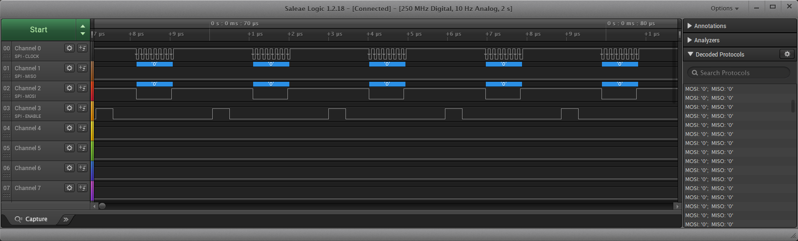

# PIC18F47Q10 Changing Data Transfer Type

## Objective
This repository contains an example of MCC generated source code for SPI as described in [*TB3265 - Getting Started with SPI using MSSP on PIC18*](http://ww1.microchip.com/downloads/en/DeviceDoc/Getting-Started-With-SPI-Using-MSSP-on-PIC18-DS90003265A.pdf) document from Microchip.
 In this demo, the SPI will be configured as host and it will be used to send data to a client device, in data mode 3.

## Related Documentation
- [TB3265 - Getting Started with SPI using MSSP on PIC18](https://www.microchip.com/wwwappnotes/appnotes.aspx?appnote=en1002275)
- [PIC18-Q10 Product Family Page](https://www.microchip.com/design-centers/8-bit/pic-mcus/device-selection/pic18f-q10-product-family)
- [PIC18F47Q10 Data Sheet](http://ww1.microchip.com/downloads/en/DeviceDoc/40002043D.pdf)
- [PIC18F47Q10 Code Examples on GitHub](https://github.com/microchip-pic-avr-examples?q=pic18f47q10-cnano&type=&language=)

## Software Used
- MPLAB® X IDE 5.30 or newer [(microchip.com/mplab/mplab-x-ide)](http://www.microchip.com/mplab/mplab-x-ide)
- MPLAB® XC8 2.10 or a newer compiler [(microchip.com/mplab/compilers)](http://www.microchip.com/mplab/compilers)
- MPLAB® Code Configurator (MCC) 3.95.0 or newer [(microchip.com/mplab/mplab-code-configurator)](https://www.microchip.com/mplab/mplab-code-configurator)
- MPLAB® Code Configurator (MCC) Device Libraries PIC10 / PIC12 / PIC16 / PIC18 MCUs 1.79.0 or newer [(microchip.com/mplab/mplab-code-configurator)](https://www.microchip.com/mplab/mplab-code-configurator)
- Microchip PIC18F-Q Series Device Support 1.3.89 or newer [(packs.download.microchip.com/)](https://packs.download.microchip.com/)

## Hardware Used
- PIC18F47Q10 Curiosity Nano [(DM182029)](https://www.microchip.com/Developmenttools/ProductDetails/DM182029)

## Setup
The PIC18F47Q10 Curiosity Nano Development Board is used as the test platform.

 

The following configurations must be made for this project:
- Clock
  - Oscillator Select: HFINTOSC
  - HF Internal Clock: 64 MHz
  - Clock Divider: 1
- MSSP1:
  - MSSP1 Enabled
  - Serial Protocol: SPI
  - Mode: Master
  - Data Mode: 3
  - Input Data Sampled At: Middle
  - Clock Source Selection: FOSC/4_SSPxADD
  - SPI Clock Frequency: 8 MHz

- Watchdog Timer: disabled
- Low-voltage Programming: enabled

|Pin           | Configuration      |
| :----------: | :----------------: |
|RC3 (SCK)     | Digital Output     |
|RC4 (SDI)     | Digital Input      |
|RC5 (SDO)     | Digital Output     |
|RC6 (SS)      | Digital Output     |

## Operation
1. Connect the board to the PC.

2. Open the *pic18f47q10-cnano-spi-mode-change-mcc.X* project in MPLAB® X IDE.

3. Set *pic18f47q10-cnano-spi-mode-change-mcc.X* project as main project. Right click on the project in the *Projects* tab and click *Set as Main Project*.

4. Select the *PIC18F47Q10 Curiosity Nano* in the *Hardware Tool* section of the project settings:
  - Right click on the project and click *Properties*;
  - Select the *PIC18F47Q10 Curiosity Nano* (click on the SN) in the *Hardware Tool* tab and then click *OK*:
 

5. Program the project to the board: right click on the project and click *Make and Program Device*.

Result:
- Channel 0 -> SCK
- Channel 1 -> SDI
- Channel 2 -> SDO
- Channel 3 -> SS
 

## Summary
This project is an illustration for a basic use case based around MSSP1 in SPI mode.
